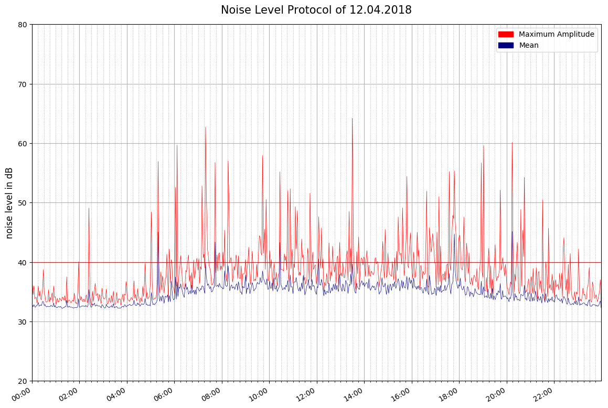

# noise_level_protocol
Raspberry Pi/Python project for noise level detection, recording and plot a noise level protocol (e.g. for loud neighbour)

  

**Introduction:**  
There are many scripts for noise detectors, noise level meters, sleep- and baby monitors out there. But nothing for my special requirements. My neighbour had very noisy parties every day and night and 60 dB in my flat. So a noise level protocol was required for further steps. In my local jurisdiction the exact value is not the essential criteria; duration, frequency, kind and personal perception are also important.

**Requirements:**  
-noise detection and saving to csv  
-record noise for later analysis as mp3  
-create a noise level plot every day  
-send me an email with the plot  

**Hardware:**  
Because I need onyl an approximate value of the noise (+-5 dB) and additionally make recordings I decided not to use a decibel meter but a usb microphone from Seacue for 12€. A USB Webcam also ca be used.
The other component is a Raspberry Pi 3 running with Raspbian.

**Installation:**  
Frist, notice that I'm not a programmer and never wrote a program before. So my scripts can be cumbersome. But it works and is easy to understand. I used absolute paths, because terminal, thonny and crontab have different home directories, not always "pi". The directory is /home/pi/noise/.
The microphone has to be set up and accessible as plughw:1,0. The script will record all the time, and then delete quiet files. Thus even loud single events can be saved, instead of activate the recording after a loud noise.

Packages/Libraries needed:  
-Matplotlib

-lame  
-libsox-fmt-mp3 

1. Create a directory with the current date in the mp3 folder for the recordings like "20180131" (YYYYMMDD). The make_dirs.py script will make this in the future, see point 7.

2. Calibrate your microphone: 
  Open detect.py and change -d 120 to -d 10 in line 28, this will shorten the recording time.
  Run detect.py at a quiet location, note down the first two numbers from  the "measured values" output (maximum amplitude and             rmsamplitude) starting at 30 dB, then increase the volume of your speakers and go up in intervals of five to 80 or 90 dB.
  Simultaneous measure the noise level with your Smartphone e.g. with "Decibel X". I had the best results while playing "brown noise"     not only the sinewave.
  
3. Create a function with the values on https://mycurvefit.com/, one for maximum amplitude, one for rms.

4. Open detect.py, set the offset you want and replace the functions with yours from mycurvefit on lines 39 and 41. Change the recording    time to 120 again in line 28.

5. If you wish an E-Mail with the plot, you can modify the gmail.py. Important is, that third party applications can access the mail        account.

6. Data can be plotted with py_plot.py or py_plot_today.py
  
7. Example for crontab to run your scripts periodically: type crontab -e in terminal and enter  
    55 23 * * *  python /home/pi/noise/make_dirs.py > /home/pi/Desktop/clog.log 2>&1 -q -f  
    05 0 * * *  python3 /home/pi/noise/py_plot.py > /home/pi/Desktop/clog.log 2>&1 -q -f  
    10 0 * * *  python3 /home/pi/noise/gmail.py > /home/pi/Desktop/clog.log 2>&1 -q -f  

For faster mp3 analysis I recommend an application with waveform like mp3directcut. For me, the script works very well. 
There are several possible modifications here, for example the creation of the waveform in python, or real-time-plotting at plot.ly.
At the end I want to thank all programmers who provide their scripts with open access, that was a big help for me. I want to do the same now, maybe someone can benefit from this.

Related links for similar projects:  
Raspberry Pi Bat Recorder and Detector http://pibat.afraidofsunlight.co.uk/sound-activated-recording  
dB/SPL meter using USB microphone https://www.raspberrypi.org/forums/viewtopic.php?t=154716  
Software for sound level / decibel data logging https://www.raspberrypi.org/forums/viewtopic.php?t=29061  
Keeping track of sound levels with the Rasp Pi http://www.raspberry-pi-geek.com/Archive/2016/15/Keeping-track-of-sound-levels-with-the-Rasp-Pi  
RaspberryPI: Motion and Noise detection https://blog.mornati.net/raspberrypi-motion-and-noise-detection/
